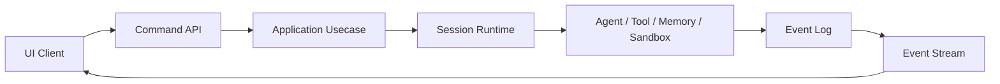

# OpenHarness Architecture

Status: accepted direction  
Date: 2026-08-17

This document is the canonical architecture overview. The concept document explains the product direction; the ADRs record specific decisions; the diagram shows the runtime shape.

Related documents:

- [Concept](openharness-concept.md)
- [ADR 0001: Plugin Capability Model](decisions/0001-plugin-capability-model.md)
- [ADR 0002: Single Harness Server Process](decisions/0002-single-harness-server-process.md)
- [ADR 0003: Plugin-Ready, Not Plugin-First](decisions/0003-plugin-ready-not-plugin-first.md)
- [ADR 0004: Model-Visible Session Event Log](decisions/0004-model-visible-session-event-log.md)
- [ADR 0005: Staged Tool Execution Pipeline](decisions/0005-staged-tool-execution-pipeline.md)
- [ADR 0006: Fail-Closed Sandbox Ladder](decisions/0006-fail-closed-sandbox-ladder.md)
- [ADR 0007: Keyless Session Replay Testing](decisions/0007-keyless-session-replay-testing.md)
- [Plugin-Ready Runtime Plan](plans/plugin-ready-runtime.md)
- [DeepSeek Harness research](research/deepseek-harness.md)
- [Runtime diagram](diagrams/openharness-runtime.architecture.html)
- [Diagram source](diagrams/openharness-runtime.architecture.json)

## System Shape

OpenHarness is a local-first, always-on agentic coding harness.

The main runtime parts are:

- **UI**: browser client that sends commands and renders events.
- **Harness server**: API, MCP surface, event stream, and built UI static assets in the target deployment.
- **Session runtime**: execution context for a project.
- **Agent runtime**: model/provider adapter that produces agent output.
- **Tool runtime**: registry and execution pipeline for built-in, local, and MCP tools.
- **Sandbox**: execution boundary for project files, commands, network, and resources.
- **Memory service**: scoped read/write/search memory with policy.
- **Event log**: durable append-only record of session and runtime events.
- **Configuration store**: durable config for projects, agents, rules, tools, MCP servers, memory, and sandbox policy.

The UI never executes agent logic. It communicates through the command API and event stream.

## Planes

### Control Plane

The control plane stores declarative configuration:

- projects
- agents
- rules
- tools
- MCP servers
- memory policy
- sandbox policy
- budgets
- permissions

The UI edits configuration through the API. Configuration is not runtime internals.

### Event Plane

The event plane moves information between the runtime and UI clients:

- command API
- event stream
- event log
- session projections
- approval state
- tool execution state
- memory update events

Commands go in. Events go out.

### Execution Plane

The execution plane performs work:

- session actor
- orchestrator
- agent runtime
- tool runtime
- sandbox
- MCP gateway
- memory service

The execution plane is isolated from the UI.

## Core Entities

| Entity | Meaning |
|---|---|
| Project | A workspace the harness can operate on. |
| Session | An execution context for a project. |
| Agent | Reusable configuration describing role, tools, permissions, model preferences, and budget. |
| Rule | Declarative when/if/then configuration that can start, guard, pause, notify, or update state. |
| Tool | A capability an agent can call through the tool registry. |
| MCP Server | A managed tool source exposed through the MCP gateway. |
| Memory | Scoped knowledge with policy, retrieval, and lifecycle. |
| Sandbox | Boundary that controls file, command, network, environment, and resource access. |
| Event | Append-only record of user-visible or model-visible runtime activity. |
| Config | Durable harness configuration for ports, projects, tools, agents, rules, and policy. |

## Data Flow

1. A UI client sends a command to the harness API.
2. The API validates the command and calls an application usecase.
3. The usecase updates session, project, or configuration state through ports.
4. The session runtime executes work using agent, tool, memory, and sandbox adapters.
5. Execution produces events.
6. Events are appended to the event log and emitted through the event stream.
7. UI clients subscribe to the stream and update their state.

## Loops

### Session Turn Loop

A session turn starts from a user command or rule trigger.

1. The session receives input.
2. The orchestrator selects the active agent configuration.
3. The agent runtime calls the model provider.
4. The model may request tool calls.
5. Tool calls pass through validation, policy, and sandbox checks.
6. Tool results are appended to the session context.
7. The loop continues until the agent produces a final response or stops.
8. Each meaningful step emits an event.

### Tool Execution Pipeline

1. The tool registry resolves the tool definition.
2. The application validates the tool input.
3. Policy checks permissions and budget.
4. The sandbox enforces execution boundaries.
5. The tool executes.
6. The result is recorded as a session event.
7. The result is returned to the agent runtime.

### Configuration Loop

1. The UI reads configuration through the API.
2. The user edits configuration.
3. The API validates the change.
4. The configuration store persists the change.
5. Future sessions and tool resolution use the updated configuration.

## Plugin Model

OpenHarness uses a plugin capability model, not a full plugin framework.

Capabilities are swappable adapters behind stable ports:

- tool providers
- model providers
- memory stores
- sandbox adapters
- persistence stores
- event transports
- rule actions
- MCP gateways

Agents, projects, sessions, rules, and tools are domain/configuration entities, not plugins.

v1 is **plugin-ready, not plugin-first**: the runtime exposes stable ports and typed internal hooks, but it does not ship an external plugin loader. External plugins can later implement the same ports and hook contracts.

See [ADR 0001](decisions/0001-plugin-capability-model.md) and [ADR 0003](decisions/0003-plugin-ready-not-plugin-first.md).

## Process Model

The target v1 deployment is a single harness server process.

That process serves:

- the command API
- the MCP server surface
- the event stream
- the built UI static assets

The UI remains a separate React package. The harness serves the built bundle as static files; it does not execute UI logic.

The current two-service Docker Compose layout is transitional.

See [ADR 0002](decisions/0002-single-harness-server-process.md).

## Current Implementation vs Target

The current codebase implements the first vertical slice:

- project listing
- sending a project message
- configuration read/update
- timeline entries from a mock agent runtime
- UI global state and API client

The target architecture adds:

- session events and event stream
- model-visible session log
- tool registry
- staged tool execution pipeline
- internal hooks
- MCP gateway
- memory service
- sandbox adapter
- durable persistence
- policy engine
- rule/trigger engine
- keyless replay testing
- generated capability catalogs

The current slice is intentionally small. It validates the UI/API/harness boundary before the execution plane is expanded.
