# OpenHarness Concept

Status: accepted direction  
Date: 2026-08-15

## Purpose

OpenHarness is a local-first agentic coding harness and IDE. It provides an always-on backend service that manages projects, sessions, agents, tools, MCP servers, memory, rules, and sandboxed execution.

The UI is a browser interface. The backend exposes only API and MCP surfaces. The app is tunneled to the outside world so the UI can be used remotely, for example from a phone.

## Core Idea

The system is command/event based:

- UI sends commands.
- Runtime executes work in the background.
- Runtime emits events.
- UIs subscribe to events and update their state.

This allows multiple UI clients to observe and control the same runtime.

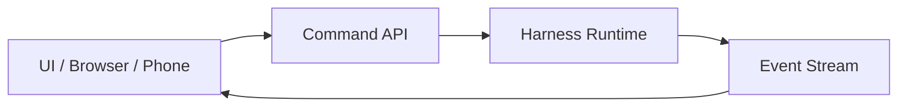

The UI never executes agent logic directly. It only sends commands and renders events.

## Chosen Architecture

OpenHarness uses an actor/session runtime with an append-only event log and a configuration plane.

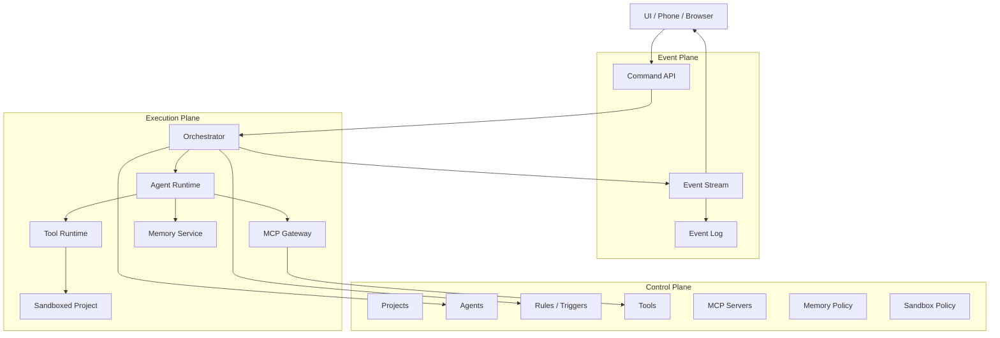

This is intentionally not a full event-sourced system. Events are used for durability, streaming, audit, and UI synchronization, but the primary execution model is session actors.

## Why This Design

### Rejected: Pure Request/Response

A simple request/response API is too weak for autonomous agents.

It makes it hard to support:

- streaming progress
- long-running sessions
- multiple UI clients
- approvals
- cancellation
- background work
- remote access with disconnected UI

### Rejected: Full Event Sourcing

Full event sourcing is useful as a reference, but too heavy for the first version.

It introduces unnecessary complexity around:

- projections
- replay
- consistency
- versioning
- state reconstruction

OpenHarness will keep an event log, but state will be managed by session actors and stores.

### Rejected: Workflow DAG Engine

A full workflow DAG engine is overkill because the “workflow editor” is really a configuration editor.

The editor should configure:

- agents
- triggers
- tools
- MCP servers
- memory
- rules
- permissions
- budgets

It should not become a low-level execution engine.

### Rejected: Temporal-like Durable Execution

A Temporal-like engine is strong, but probably too heavy before the basic harness works.

It can be revisited later if long-running durable workflows become a core requirement.

## Planes

### Control Plane

The control plane stores configuration.

It contains:

- projects
- agents
- rules
- triggers
- tools
- MCP servers
- memory policy
- sandbox policy
- budgets
- permissions

Configuration is declarative. The UI edits configuration, not runtime internals.

### Event Plane

The event plane moves information between the runtime and UIs.

It contains:

- command API
- event stream
- event log
- session state projections
- approval state
- tool execution state
- memory update events

Commands go in. Events go out.

### Execution Plane

The execution plane performs work.

It contains:

- orchestrator
- agent runtime
- tool runtime
- sandbox
- MCP gateway
- memory service

The execution plane is isolated from the UI. UIs do not directly manipulate agents, tools, files, or commands.

## UI and Remote Access

Only the app UI/API is tunneled to the outside world.

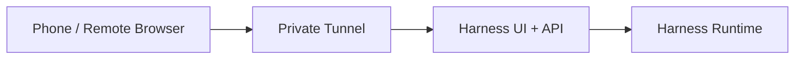

The tunnel exposes the harness application, not the raw machine.

The UI can be used from:

- local browser
- remote browser
- phone
- multiple devices at once

All UIs communicate with the same runtime through the same API and event stream.

## Sessions and Agents

A session is an execution context for a project.

An agent is a reusable configuration, not a one-off prompt.

An agent describes:

- role
- description
- goals
- tools
- MCP access
- memory access
- permissions
- sandbox policy
- budget
- model preferences

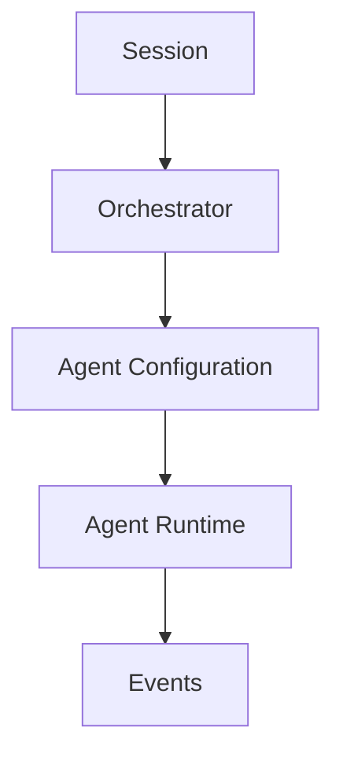

The orchestrator decides which agent should run, what context it receives, and what actions are allowed.

## Workflow Editor

The workflow editor is a configuration editor disguised as a workflow editor.

It visually edits relationships between:

- agents
- triggers
- tools
- MCP servers
- memory
- rules
- permissions

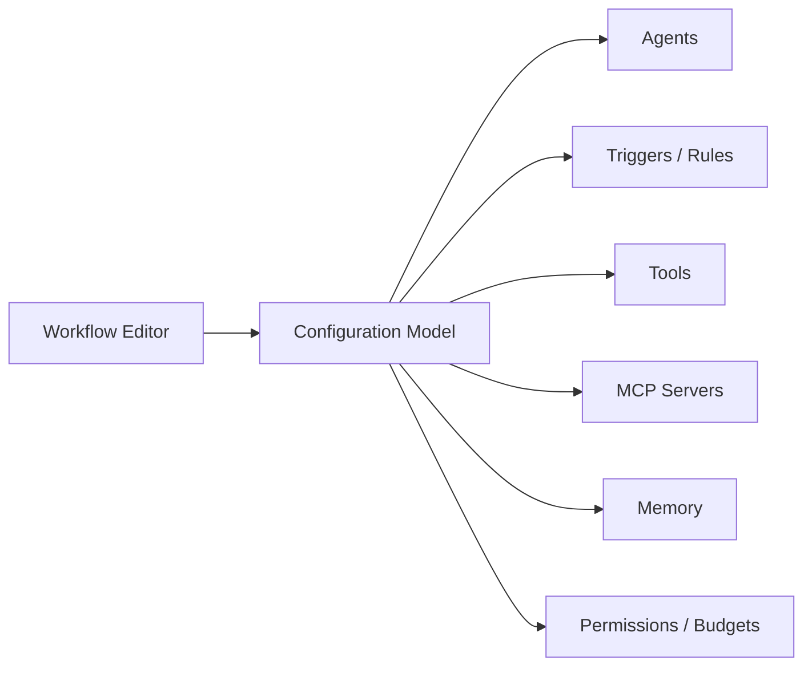

The visual “nodes” are not primarily execution steps. They are configuration objects and relationships.

## Rules and Triggers

Rules connect events or conditions to actions.

A rule has a high-level shape:

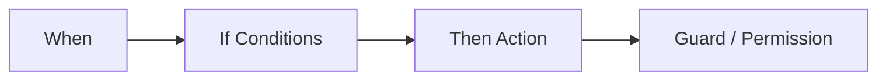

Rules can:

- start an agent
- request approval
- deny an action
- send a notification
- update memory
- trigger a tool
- pause a session
- enforce a budget

Rules are configuration, not code.

## Tools

Tools are capabilities available to agents.

All tools are exposed through a unified tool registry.

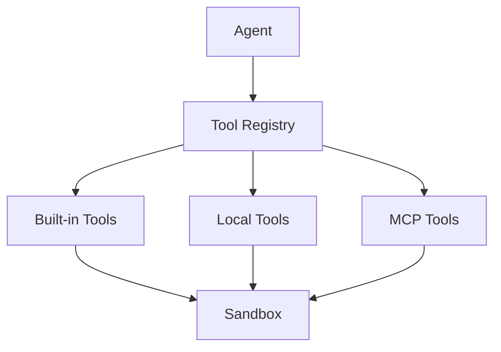

The agent does not care whether a tool is built-in, locally loaded, or provided by MCP.

Tool sources:

- built-in tools
- local dynamic tools
- MCP tools

The registry handles:

- discovery
- validation
- permissions
- invocation
- lifecycle
- reload
- unloading

## MCP

MCP servers are managed as configuration.

At runtime, MCP servers become tool sources.

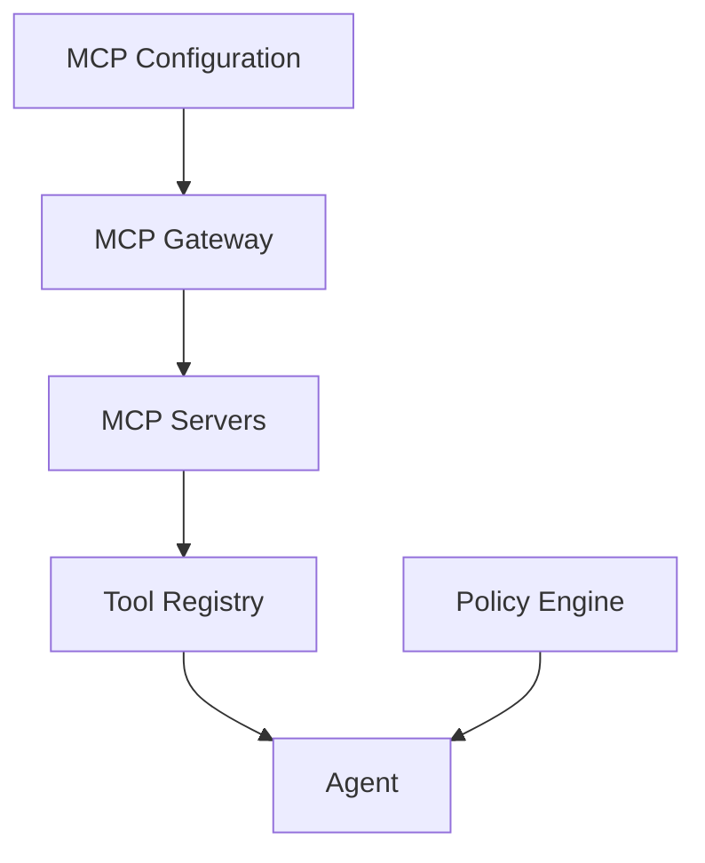

MCP is not a separate agent system. It is another tool source.

The policy engine still controls what MCP-backed tools may do.

## Sandbox

The sandbox is the execution boundary for project work.

Everything that touches the real project goes through the sandbox.

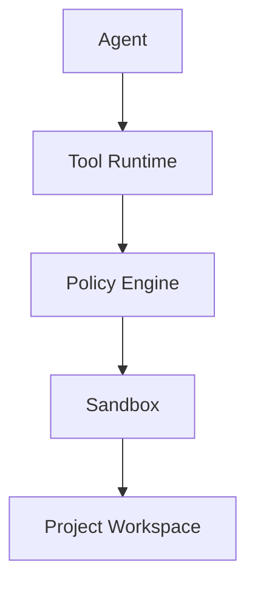

The sandbox controls:

- file access
- command execution
- network access
- environment variables
- resource limits
- approval requirements

The UI and API never directly manipulate project files.

Autonomy is expressed through sandbox and permission levels, for example:

- read-only
- workspace write
- command allowlist
- unattended workspace
- full sandbox

## Memory

Memory is a first-class service and a tool available to agents.

It is not just a vector database. It is a scoped memory system with policy, retrieval, and lifecycle.

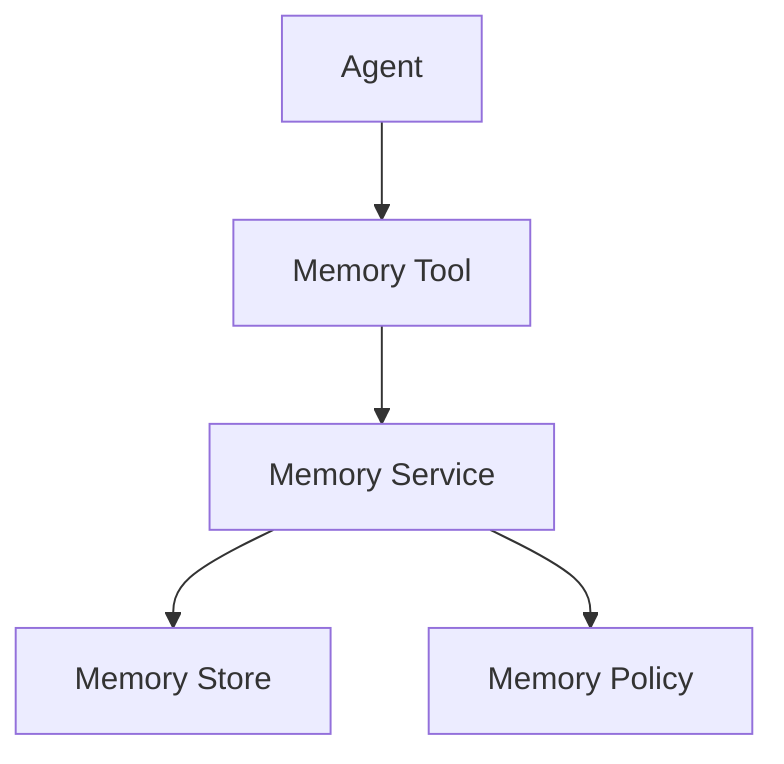

### Memory Scopes

Memory belongs to scopes.

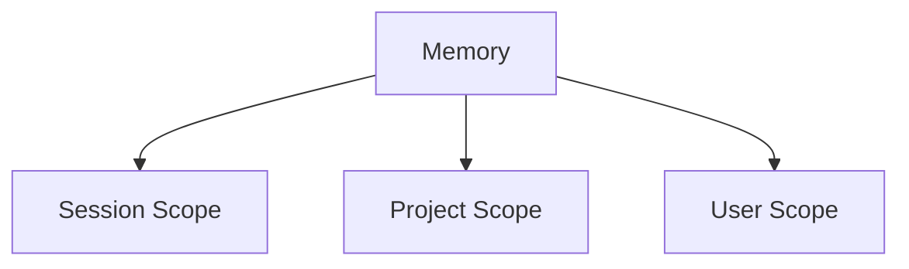

Session scope holds short-term context for the current run.

Project scope holds long-term knowledge about a project.

User scope holds user preferences and cross-project knowledge.

### Memory Kinds

Memory can be organized by kind.

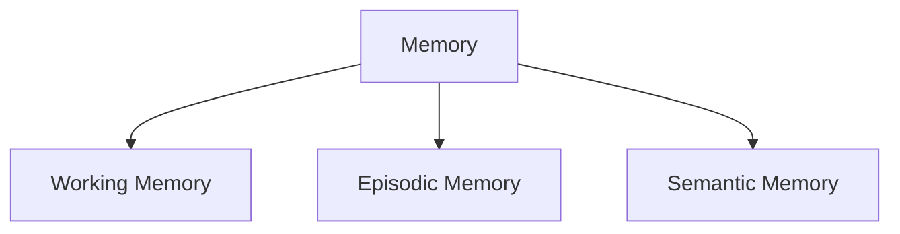

Working memory supports the active session.

Episodic memory records what happened in past runs.

Semantic memory stores reusable facts, notes, summaries, and learned patterns.

### Memory Operations

Agents interact with memory through a small tool surface.

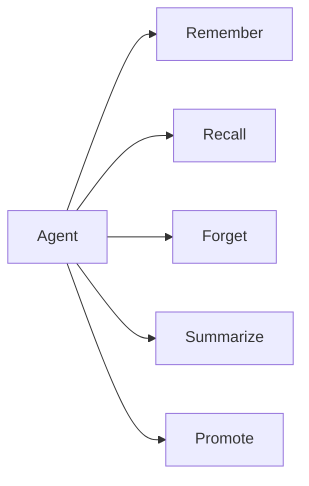

High-level operations:

- remember a fact or note
- recall relevant memories
- forget or expire a memory
- summarize context
- promote short-term memory into long-term memory

Not every observation should become long-term memory. Promotion should be explicit or policy-driven.

### Memory Retrieval

Retrieval should be hybrid, not only semantic search.

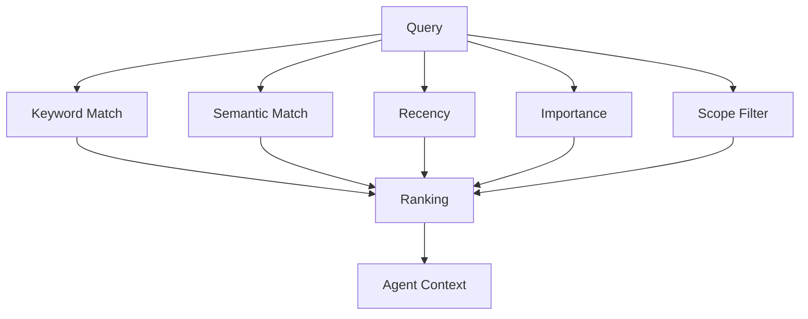

Memory retrieval must respect scope and permissions. An agent should not freely read or write all memory.

## Key Decisions

1. Use an actor/session runtime with an event log.
2. Do not build a full event-sourced system in the first version.
3. Use command API in and event stream out.
4. Support multiple UI clients through the same event stream.
5. Tunnel only the app UI/API, not the raw machine.
6. Keep strict separation between UI and backend.
7. Keep backend hexagonal and spec-driven.
8. Treat the workflow editor as a configuration editor.
9. Treat agents as reusable configuration objects.
10. Treat rules and triggers as declarative configuration.
11. Use a unified tool registry for built-in, local, and MCP tools.
12. Treat MCP as a tool source, not a separate execution model.
13. Put all project access behind a sandbox boundary.
14. Make memory a scoped service with policy and hybrid retrieval.
15. Use OpenCode as a reference, not a direct architecture copy.

## Consequences

This design implies the following major components:

- command API
- event stream
- event log
- session actor
- orchestrator
- agent configuration model
- rule/trigger engine
- tool registry
- MCP gateway
- sandbox adapter
- memory service
- memory tool
- permission/policy engine
- project store
- configuration store

The UI will need:

- command client
- event subscription client
- session view
- agent/configuration editor
- workflow-style configuration editor
- approval UI
- tool activity view
- memory browser
- project dashboard

## Open Questions

- Storage choice: SQLite first, Postgres later?
- Tunneling choice: Tailscale, Cloudflare Tunnel, or another private tunnel?
- First sandbox level: process sandbox, container sandbox, or logical path boundary first?
- Memory backend: file-based, SQLite, vector store, or hybrid?
- Event transport: SSE first, WebSocket later?
- Configuration format: JSON, YAML, or TypeScript-backed config?
- How deeply should rules be visualized in the first editor version?
